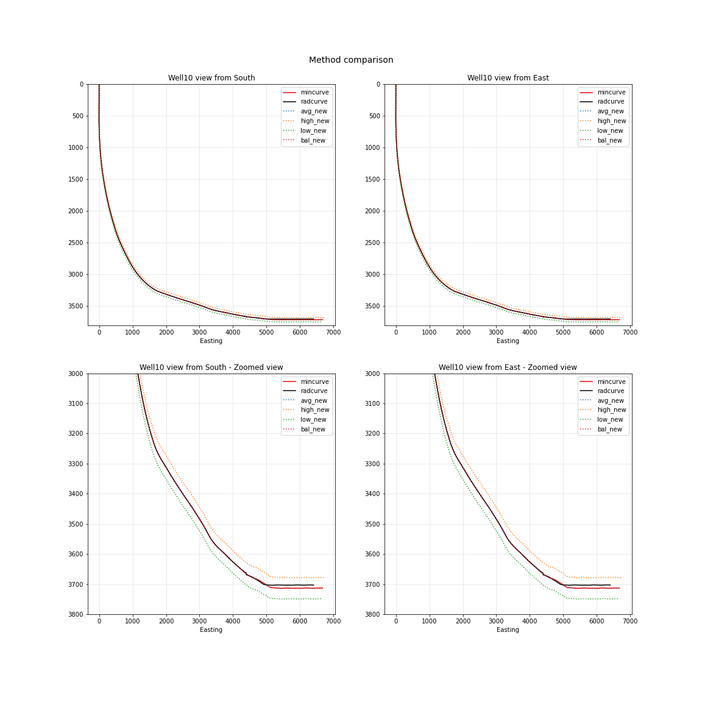

*******************
Wellpathpy tutorial
*******************

This document aims to provide a sample workthrough using wellpathpy showing:

- `Abbreviations`_
- `Imports`_
- `Loading a deviation`_
- `Loading the well header`_
- `Converting units`_
- `Converting deviation surveys to positional logs`_
- `Well location and tvdss`_
- `Exporting results`_

Abbreviations
#############

=============== ==========================================================================
m               metres
ft              feet
md              measured depth
inc             inclination
azi             azimuth
tvd             true vertical depth
east_offset     horizontal distance away from wellhead towards the east
north_offset    horizontal distance away from wellhead towards the north
tvdss           true vertical depth subsea
mE              horizontal distance in meters away from surface location towards the east
mN              horizontal distance in meters away from surface location towards the north
=============== ==========================================================================

Imports
#######

In this tutorial, we will alias wellpathpy as wp:

.. code-block:: python

   import wellpathpy as wp

Loading a deviation
###################

Wellpathpy provides a fairly simple loading function for reading a deviation
survey from CSV.

Loading a deviation from CSV
****************************

A valid input file must be a CSV file containing the columns: md, inc, azi in that order, as shown in this example:

.. code-block:: python

    md,inc,azi
    0,0,244
    10,11,220
    50,43,254
    150,78.5,254
    252.5,90,359.9

- column headers are generally expected but will be skipped when the file is read
- if no headers are provided, the ``skiprows`` argument can be set to ``0``
- md must increase monotonically
- as inc and azi cannot be distinguished numerically it is the user's responsibility to ensure the data are passed in this order
- inc must be in range 0 <= inc < 180 (to allow for horizontal wells to climb)
- azi must be in range 0 <= azi < 360

You can then load them into wellpathpy using:

.. code-block:: python

   md, inc, azi = wp.read_csv(fname)

``wp.read_csv`` simply calls ``np.loadtxt`` with ``delimiter=','`` and ``skiprows=1``.
These can be changed if required; for example the ``delimiter`` and ``skiprows`` can be changed with:

.. code-block:: python

   md, inc, azi = wp.read_csv(fname, delimiter='\t', skiprows=0)

Additional ``kwargs`` accepted by ``np.loadtxt`` can also be passed in, for example:

.. code-block:: python

   md, inc, azi = wp.read_csv(fname, comments='$')

**Notes**:

Some simple sanity checks are performed to reject bad CSVs. ``wp.read_csv`` supports all options ``np.loadtxt``
supports. Only those columns named md, inc, azi will be read.

If the deviation survey is not in CSV, is generated in a different place in your
program, or is from some other source, wellpathpy is still useful. If you
provide three ``np.ndarray`` md, inc, and azi, the rest of wellpathpy works fine.

Observe that the same basic requirements still apply:

- md, inc and azi have the same shape
- md increases monotonically
- inc is in range 0-180
- azi is in range 0-360

Once ``md``, ``inc`` and ``azi`` have been returned from ``wp.read_csv()``, an instance of
the ``wp.deviation()`` class is created with:

.. code-block:: python

   dev = wp.deviation(
       md = md,
       inc = inc,
       azi = azi
   )

With this, it is then possible to resample the depths using the ``minimum_curvature()`` method
 and go back to a deviation survey in ``md``, ``inc`` and ``azi``:

.. code-block:: python

   step = 30
   depths = list(range(0, int(dev.md[-1]) + 1, step))
   pos = dev.minimum_curvature().resample(depths = depths)
   dev2 = pos.deviation()

**Notes**:

With increasing step size, float uncertainty can introduce some noise as shown in the figures below.
First we see an overview of the well in 3D, followed by plots of inclination and azimuth versus depth.

Loading the well header
#######################

To make sense of the deviation position, wellpathpy supports reading a survey
header from json file. The header requires the following keys:

.. code-block:: json

    {
    "datum": "kb",
    "elevation_units": "m",
    "elevation": 100.0,
    "surface_coordinates_units": "m",
    "surface_easting": 1000.0,
    "surface_northing": 2000.0
    }

.. code-block:: python

    header = wp.read_header_json(fname)

**Notes**:

This function is provided for convenience - wellpathpy does not care about the
source of this data. It will simply use ``json.load()`` to read the JSON file and save it as a python ``dict``.

Converting units
################

Wellpathpy does not implicitly convert between unit systems for you, but
assumes all units are consistent. In practice, that's not always the case, and
wellpathpy provides a simple function to convert data between unit systems.

That means wellpathpy assumes the provided date are in SI units and degrees:

    ===================  =================================
    md                   meters
    inc                  degrees
    azi                  degrees
    elevation            meters above mean sea level
    surface_easting      meters east of reference point
    surface_northing     meters north of reference point
    ===================  =================================

**Notes:**

- The units for elevation, surface_northing and surface_easting must be the same as the md units before any md->tvd calculations are run, otherwise you will get inconsistent results.
- inc and azi must always be passed as degrees, otherwise erroneous results will be returned.

Conversion API
**************

To convert between unit systems, you can use the `unit_convert` function:

.. code-block:: python

    md               = wp.unit_convert(md, src='ft', dst='m')
    elevation        = wp.unit_convert(header['elevation'],
                                   src=header['elevation_units'], dst='m')
    surface_easting  = wp.unit_convert(header['surface_easting'],
                                    src=header['surface_coordinates_units'],
                                    dst='m')
    surface_northing = wp.unit_convert(header['surface_northing'],
                                    src=header['surface_coordinates_units'],
                                    dst='m')

Observe that the elevation and coordinate units are never explicitly read in
the program, they're only passed to unit_convert.

Using the same well as an example, which currently has MD units in 'ft':

.. code-block:: python

   # MD units in feet:
   print('MD min: {:>7.2f} ft\nMD max: {:>7.2f} ft'.format(md.min(), md.max()))
   MD min:    0.00 ft
   MD max: 9450.67 ft

Conversion to metres can be done with ``wp.unit_convert()``:

.. code-block:: python

   md = wp.unit_convert(md, src='ft', dst='m')
   # MD units in metres:
   print('MD min: {:>7.2f} m\nMD max: {:>7.2f} m'.format(md.min(), md.max()))
   MD min:    0.00 m
   MD max: 2880.56 m

The `pint <https://github.com/hgrecco/pint>`_ library drives the unit
conversion. If you require units not already known to pint, you can pass your
own `unit registry <https://pint.readthedocs.io/en/latest/defining.html#programmatically>`_.
Consider the need of converting a bizarre devation survey in
`ell <https://en.wikipedia.org/wiki/Ell>`_ to meters:

.. code-block:: python

    import pint
    ureg             = pint.UnitRegistry()
    ureg.define('ell = 0.6275 * meter = ell')
    result           = wp.unit_convert(data, src='ell', dst='m', ureg=ureg)

Converting deviation surveys to positional logs
###############################################

All these methods can be accessed from the *deviation* object created with:

.. code-block:: python

   dev = wp.deviation(
       md = md,
       inc = inc,
       azi = azi,
       )

Standard method
***************

The standard method for converting a **deviation surveys** [md, inc, azi] into a **positional logs** [tvd, northing, easting] is the *minimum curvature* method.
This method is provided by wellpathpy and is recommended for most use cases.

- **minimum curvature method** : ``dev.minimum_curvature()``
    This method uses angles from upper and lower end of survey interval to
    calculate a curve that passes through both survey points.
    This curve is
    smoothed by use of the ratio factor defined by the tortuosity or dogleg
    of the wellpath.
    This method returns a dogleg severity calculated for a given course_length.

Comparison methods
******************

Other methods are provided should the need arise to compare *mininum curvature* to older surveys that may have been calculated with one of these methods.
In general these other methods are **not recommended**.

- **radius of curvature method** : ``dev.radius_curvature()``
    Calculate TVD using radius or curvature method.
    **Caution**: this will yield unreliable results when data are closely spaced
    or when the borehole is straight but deviated.
    This method uses angles from upper and lower end of survey interval to
    calculate a curve that passes through both survey points.
- **average tan method** : ``dev.tan_method()``
    Calculate TVD using average tangential method.
    This method averages the inclination and azimuth at the top and
    bottom of the survey interval before taking their sine and cosine,
    this average angle is used to estimate tvd.
- **balanced tan method** : ``dev.tan_method(choice='bal')``
    Calculate TVD using balanced tangential method.
    This method takes the sines and cosines of the inclination and azimuth
    at the top and bottom of the survey interval before averaging them,
    this average angle is used to estimate tvd.
    This will provide a smoother curve than the average tan method but requires
    closely spaced survey stations to avoid errors.
- **high tan method** : ``dev.tan_method(choice='high')``
    Calculate TVD using high tangential method.
    This method takes the sines and cosines of the inclination and azimuth
    at the bottom of the survey interval to estimate tvd.
    This method is **not recommended** as it can make gross tvd and offset
    errors in typical deviated wells.
- **low tan method** : ``dev.tan_method(choice='low')``
    Calculate TVD using low tangential method.
    This method takes the sines and cosines of the inclination and azimuth
    at the top of the survey interval to estimate tvd.
    This method is **not recommended** as it can make gross tvd and offset
    errors in typical deviated wells.

Usage
*****

In order to use these functions, you first need a deviation object as described in `Loading a deviation`_.
You can then run the following methods once you've imported your :ref:`deviation<Loading a deviation>` and :ref:`header<Loading the well header>` and done any :ref:`unit conversion<Converting units>` required as described above.

.. code-block:: python

    # The recommended method for most use-cases
    tvd, northing, easting, dls = dev.mininum_curvature(course_length=30)

    # Comparison methods to contrast with older deviation surveys
    tvd, northing, easting      = dev.radius_curvature()
    tvd, northing, easting      = dev.tan_method() # for the default 'avg' method
    tvd, northing, easting      = dev.tan_method(choice='bal')
    tvd, northing, easting      = dev.tan_method(choice='high')
    tvd, northing, easting      = dev.tan_method(choice='low')

We can compare the outputs of all these methods in the figure below:

Well location and tvdss
#######################

The methods above are not aware of surface location or datum elevation.
If you want to move the positional log to a given surface location, to 0,0 coordinates, or shift the tvd to tvdss,
you can use the following functions which return a copy of the positional log by default (``inplace=False``).

- to shift a positional log to a wellhead location

.. code-block:: python

    pos_wellhead = pos.to_wellhead(surface_northing=surface_northing,
                                   surface_easting=surface_easting)

- to shift a positional log to a 0,0 coordinate location

.. code-block:: python

    pos_zero = pos_wellhead.loc_to_zero(surface_northing=surface_northing,
                                        surface_easting=surface_easting)

- to shift a positional log to tvdss

.. code-block:: python

    pos_tvdss = pos.loc_to_tvdss(datum_elevation=header['elevation'])

If you have a header loaded as shown in the `Loading the well header`_ section, you can use that object to access the required properties with:

.. code-block:: python

    surface_northing = header['surface_northing']
    surface_easting  = header['surface_easting']
    datum_elevation  = header['datum_elevation']

**Notes:**

Ensure you have consistent units, and use `Converting units`_ if required to ensure consistency.

Exporting results
#################

The two main ``wellpathpy`` objects; ``deviation`` and ``position`` logs can be written to CSV via
object methods as shown below. These both call ``np.savetxt`` with ``fmt='%.3f'`` and ``delimiter=','``.
The ``deviation`` also has ``header='md,inc,azi'`` and the ``postition`` has ``header='easting,northing,depth'``.
Other ``kwargs`` accepted by ``np.savetxt`` are also accepted.

- for a deviation survey:

.. code-block:: python

    dev.to_csv('./deviation.csv')

- for a positional log:

.. code-block:: python

    pos.to_csv('./position.csv')

Additional ``kwargs`` can be passed like:

.. code-block:: python

    dev.to_csv('./deviation.csv', fmt='%.2e')
    pos.to_csv('./position.csv', header='X,Y,Z', comments='$')

This is a pretty straight-forward function convenient CSV writing. If you need
more control, or more sophisticated output, you must implement your own writer.
